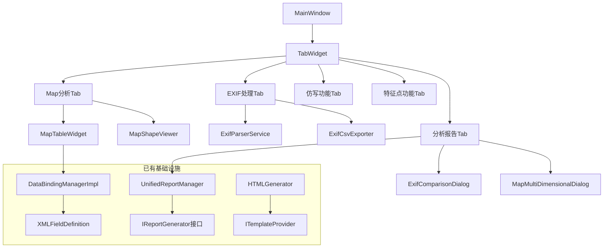
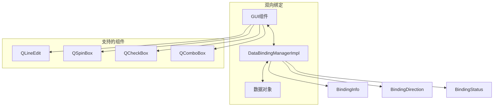
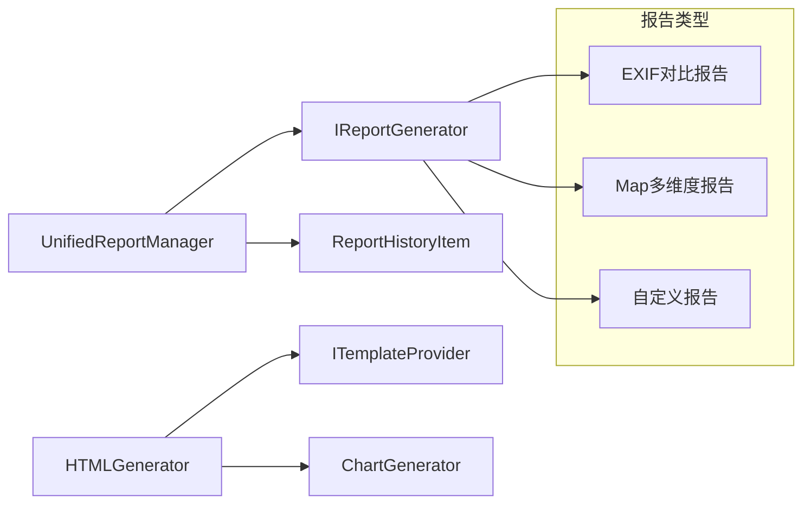
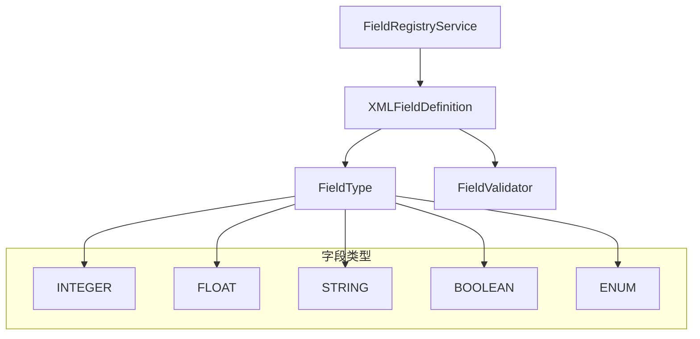
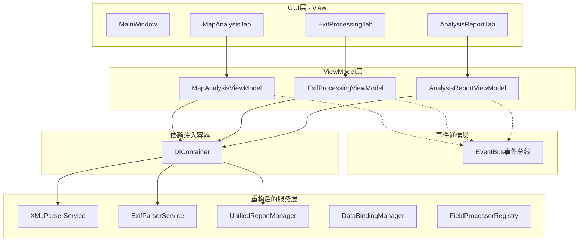

# FastMapV2 架构解耦分析与重构设计

## 概述

本文档分析FastMapV2项目的架构设计，重点评估GUI层的4个Tab模块间的耦合性，识别架构问题并提出解耦重构方案。

## 当前架构分析

### 项目类型识别
FastMapV2是一个基于PyQt5的**桌面应用程序**，用于Map配置分析与仿写，属于专业工具类桌面应用。

### 现有GUI架构概览



### Tab功能职责

| Tab名称 | 主要功能 | 状态 | 耦合程度 |
|---------|----------|------|----------|
| Map分析Tab | XML文件加载、Map点列表显示、形状可视化 | ✅ 已实现 | 🔴 高（直接在MainWindow创建） |
| EXIF处理Tab | 图片目录解析、字段选择、CSV导出 | ✅ 已实现 | 🟡 中（独立类但依赖parent） |
| 仿写功能Tab | Map配置仿写功能 | ⏳ 占位符 | 🟢 低（简单占位符） |
| 特征点功能Tab | 特征点分析功能 | ⏳ 占位符 | 🟢 低（简单占位符） |
| 分析报告Tab | 统一报告生成与管理 | ✅ 已实现 | 🟡 中（独立类但需parent数据） |

## 耦合性问题分析

### 🔴 高耦合问题识别

#### 1. 直接引用耦合
**问题描述**: MainWindow直接创建和管理所有Tab实例
```python
# 在main_window.py中
self.map_analysis_tab = self.create_map_analysis_tab()
self.exif_processing_tab = self.create_exif_processing_tab()
# 直接在主窗口内创建UI组件
self.map_table = MapTableWidget()
self.map_shape_viewer = MapShapeViewer()
```

**耦合程度**: 🔴 高 - Tab与MainWindow紧密耦合

#### 2. 状态共享耦合
**问题描述**: Tab间通过MainWindow共享状态和数据
```python
# 分析报告Tab需要访问Map分析Tab的数据
main_window = self.get_main_window()
if not hasattr(main_window, 'map_configuration'):
    QMessageBox.warning(self, "警告", "请先在Map分析标签页进行Map数据分析")
```

**耦合程度**: 🔴 高 - Tab间存在隐式依赖

#### 3. 信号槽直连耦合
**问题描述**: 组件间直接连接信号槽
```python
self.map_table.map_point_selected.connect(self.on_map_point_selected)
self.map_table.base_boundary_selected.connect(self.on_base_boundary_selected)
```

**耦合程度**: 🟡 中 - 存在直接通信依赖

### 🟡 部分实现的解耦基础设施

#### 1. 数据绑定管理器 ✅ 已实现
项目实现了高质量的数据绑定系统：



#### 2. 报告生成系统 ✅ 已实现
统一的报告生成架构：



#### 3. 字段注册系统 ✅ 已实现
动态字段管理机制：



#### ❌ 缺失的解耦基础设施

1. **事件总线系统** - 未实现全局事件通信
2. **数据上下文管理器** - 缺少集中式状态管理
3. **依赖注入容器** - 没有服务定位器模式
4. **Tab接口标准化** - Tab间缺乏统一接口

## 基于MVVM+DI的架构重构设计

### 目标架构：MVVM+依赖注入的解耦系统



### 重构的六个关键阶段

#### 阶段1：分析当前代码结构

**需要重构的关键文件识别**:

```
🔴 高优先级重构文件:
├── gui/main_window.py              # 直接创建服务实例
├── gui/tabs/exif_processing_tab.py # 业务逻辑过重
├── core/services/xml_parser_service.py # 职责过多
└── core/services/exif_parser_service.py # 逻辑复杂

🟡 中优先级重构文件:
├── gui/tabs/analysis_report_tab.py # 依赖外部状态
├── gui/widgets/map_table_widget.py # 直接数据绑定
└── core/services/unified_report_manager.py # 可拆分

🟢 低优先级重构文件:
├── gui/widgets/map_shape_viewer.py # 相对独立
├── core/services/data_binding_manager_impl.py # 已较好
└── core/services/html_generator.py # 职责单一
```

#### 阶段2：创建基础设施

**1. 依赖注入容器**
```python
class DIContainer:
    def __init__(self):
        self._services = {}
        self._singleton_instances = {}
    
    def register_singleton(self, service_type, implementation):
        # 注册单例服务
    
    def register_transient(self, service_type, implementation):
        # 注册瞬态服务
    
    def resolve(self, service_type):
        # 解析服务实例
```

**2. ViewModel基类**
```python
class BaseViewModel(QObject):
    property_changed = pyqtSignal(str, object)
    error_occurred = pyqtSignal(str)
    
    def __init__(self, event_bus, di_container):
        super().__init__()
        self._event_bus = event_bus
        self._di_container = di_container
```

#### 阶段3：服务层拆分与重组

**当前服务层问题分析**:

```
当前core/services目录结构（按功能混合）：
├── chart_generator.py                      # 图表生成 - 报告功能
├── combined_report_data_provider.py         # 综合报告数据 - 报告功能
├── data_binding_manager_impl.py             # 数据绑定 - 通用基础
├── exif_comparison_report_generator.py      # EXIF对比报告 - EXIF功能
├── exif_csv_exporter.py                    # EXIF CSV导出 - EXIF功能
├── exif_parser_service.py                  # EXIF解析 - EXIF功能
├── exif_raw_exporter.py                    # EXIF原始导出 - EXIF功能
├── exif_report_helpers.py                  # EXIF报告辅助 - EXIF功能
├── field_editor_factory.py                 # 字段编辑器 - 通用基础
├── field_registry_service.py               # 字段注册服务 - 通用基础
├── html_generator.py                       # HTML生成 - 报告功能
├── image_classifier_service.py             # 图像分类 - 特征点功能
├── image_export_service.py                 # 图像导出 - EXIF功能
├── image_export_workflow_service.py        # 图像导出流程 - EXIF功能
├── map_analyzer.py                         # Map分析 - Map功能
├── map_multi_dimensional_report_generator.py # Map多维度报告 - Map功能
├── multi_dimensional_analyzer.py           # 多维度分析 - Map功能
├── temperature_span_analyzer.py            # 温度范围分析 - Map功能
├── unified_report_manager.py               # 统一报告管理 - 报告功能
├── xml_parser_service.py                   # XML解析 - Map功能
└── xml_writer_service.py                   # XML写入 - Map功能
```

**重组后的服务层结构设计**:

```
新的core/services目录结构（按GUI功能分类）：

core/services/
├── map_analysis/                    # Map分析相关服务
│   ├── __init__.py
│   ├── xml_parser_service.py        # XML解析服务
│   ├── xml_writer_service.py        # XML写入服务
│   ├── xml_validation_service.py    # XML验证服务 (新拆分)
│   ├── map_analyzer.py              # Map数据分析
│   ├── temperature_span_analyzer.py # 温度范围分析
│   ├── multi_dimensional_analyzer.py # 多维度分析
│   └── map_conversion_service.py    # Map数据转换 (新拆分)
│
├── exif_processing/                 # EXIF处理相关服务
│   ├── __init__.py
│   ├── exif_parser_service.py       # EXIF解析服务
│   ├── exif_discovery_service.py    # EXIF字段发现 (新拆分)
│   ├── exif_csv_exporter.py         # CSV导出服务
│   ├── exif_raw_exporter.py         # 原始数据导出
│   ├── image_export_service.py      # 图像导出服务
│   ├── image_export_workflow_service.py # 图像导出流程
│   ├── file_handler_service.py      # 文件处理服务 (新拆分)
│   └── progress_manager_service.py  # 进度管理服务 (新拆分)
│
├── copywriting/                     # 仿写功能相关服务 (占位符)
│   ├── __init__.py
│   ├── config_comparison_service.py # 配置对比服务 (预留)
│   ├── offset_calculation_service.py # 偏移计算服务 (预留)
│   └── copywriting_engine_service.py # 仿写引擎服务 (预留)
│
├── feature_points/                  # 特征点功能相关服务 (占位符)
│   ├── __init__.py
│   ├── image_classifier_service.py  # 图像分类服务
│   ├── feature_extraction_service.py # 特征提取服务 (预留)
│   └── pattern_recognition_service.py # 模式识别服务 (预留)
│
├── reporting/                       # 报告生成相关服务
│   ├── __init__.py
│   ├── unified_report_manager.py    # 统一报告管理
│   ├── html_generator.py            # HTML生成服务
│   ├── chart_generator.py           # 图表生成服务
│   ├── exif_comparison_report_generator.py # EXIF对比报告
│   ├── map_multi_dimensional_report_generator.py # Map多维度报告
│   ├── combined_report_data_provider.py # 综合报告数据提供
│   ├── exif_report_helpers.py       # EXIF报告辅助工具
│   └── template_manager_service.py  # 模板管理服务 (新拆分)
│
└── shared/                          # 共享通用服务
    ├── __init__.py
    ├── data_binding_manager_impl.py # 数据绑定管理
    ├── field_registry_service.py   # 字段注册服务
    ├── field_editor_factory.py     # 字段编辑器工厂
    ├── cache_manager_service.py    # 缓存管理服务 (新增)
    ├── error_handler_service.py    # 错误处理服务 (新增)
    ├── validation_service.py       # 数据验证服务 (新增)
    └── logging_service.py          # 日志服务 (新增)
```

**服务模块重组任务列表**:

```
🔄 服务模块重组任务:

1. 📁 创建新的目录结构
   ├── 创建 map_analysis/ 目录
   ├── 创建 exif_processing/ 目录
   ├── 创建 copywriting/ 目录 (占位符)
   ├── 创建 feature_points/ 目录 (占位符)
   ├── 创建 reporting/ 目录
   └── 创建 shared/ 目录

2. 🚚 移动现有服务文件
   ├── xml_parser_service.py → map_analysis/
   ├── xml_writer_service.py → map_analysis/
   ├── map_analyzer.py → map_analysis/
   ├── temperature_span_analyzer.py → map_analysis/
   ├── multi_dimensional_analyzer.py → map_analysis/
   ├── exif_*.py → exif_processing/
   ├── image_export_*.py → exif_processing/
   ├── image_classifier_service.py → feature_points/
   ├── html_generator.py → reporting/
   ├── chart_generator.py → reporting/
   ├── *_report_*.py → reporting/
   └── data_binding_*.py → shared/

3. ✂️ 拆分过重的服务类
   ├── XMLParserService → 拆分为 解析/验证/转换服务
   ├── ExifParserService → 拆分为 解析/发现/处理服务
   └── HTMLGenerator → 拆分为 生成/模板管理服务

4. 🆕 创建新的通用服务
   ├── CacheManagerService - 缓存管理
   ├── ErrorHandlerService - 错误处理
   ├── ValidationService - 数据验证
   └── LoggingService - 日志管理

5. 🔗 更新引用关系
   ├── 更新 ViewModel 中的服务引用
   ├── 更新 DIContainer 中的服务注册
   └── 更新单元测试中的import路径
```

**服务模块重组的优势**:

1. **功能集中**: 相关服务集中在同一目录，便于维护
2. **职责分明**: 每个目录对应一个GUI功能模块
3. **更好的可测试性**: 按功能组织的测试用例
4. **支持增量开发**: 新功能只需在对应目录下添加
5. **更好的打包支持**: 可按功能模块独立打包

#### 阶段4：配置管理优化

**字段处理器注册表**:
```python
class FieldProcessorRegistry:
    def __init__(self):
        self._processors = {}
    
    def register_processor(self, field_type, processor):
        # 注册字段处理器
    
    def get_processor(self, field_type):
        # 获取字段处理器
```

#### 阶段5：GUI层重构

**移除直接服务依赖**:
```python
# 重构前
class ExifProcessingTab(QWidget):
    def __init__(self, parent):
        self.parser = ExifParserService()  # 直接创建
        self.exporter = ExifCsvExporter()  # 直接创建

# 重构后
class ExifProcessingTab(QWidget):
    def __init__(self, parent, viewmodel):
        self.viewmodel = viewmodel  # 使用ViewModel
```

#### 阶段6：事件总线优化

**ViewModel间通信**:
```python
class MapAnalysisViewModel(BaseViewModel):
    def load_xml_file(self, file_path):
        # 处理业务逻辑
        self.emit_event(EventType.MAP_LOADED, {
            'file_path': file_path,
            'map_count': len(self.map_data)
        })

class AnalysisReportViewModel(BaseViewModel):
    def _setup_event_subscriptions(self):
        self._event_bus.subscribe(
            EventType.MAP_LOADED, 
            self._on_map_loaded
        )
```

### 重构收益

#### 短期收益
- **职责分离**: GUI专注UI，ViewModel处理业务逻辑
- **依赖解耦**: 通过DI容器管理所有依赖关系
- **服务细化**: 每个服务职责单一，易于维护

#### 长期收益
- **可测试性**: ViewModel可独立进行单元测试
- **可扩展性**: 新功能通过注册服务和处理器添加
- **团队协作**: 前后端可并行开发

### 实施计划（4周）

#### 🗓️ **第1周：代码分析 + 基础设施搭建** 🚀

**步骤1：创建目录结构**
```bash
# 在core目录下创建新的基础设施目录
mkdir -p core/events
mkdir -p core/container  
mkdir -p core/viewmodels
mkdir -p core/config
```

**步骤2：实现事件总线系统**

创建文件: `core/events/event_bus.py`
```python
# 事件类型枚举
class EventType(Enum):
    MAP_LOADED = "map_loaded"
    MAP_POINT_SELECTED = "map_point_selected"
    EXIF_DATA_LOADED = "exif_data_loaded"
    REPORT_GENERATED = "report_generated"
    # ...更多事件类型

# 事件数据类
@dataclass
class Event:
    event_type: EventType
    source: str
    data: Dict[str, Any]
    timestamp: datetime = None

# 事件总线实现
class EventBus(QObject):
    event_emitted = pyqtSignal(object)
    
    def __init__(self):
        super().__init__()
        self._subscribers = {}
        self._event_history = []
    
    def subscribe(self, event_type, callback):
        # 订阅事件实现
    
    def emit(self, event_type, source, data):
        # 发射事件实现

event_bus = EventBus()
```

**步骤3：实现依赖注入容器**

创建文件: `core/container/di_container.py`
```python
class DIContainer:
    def __init__(self):
        self._services = {}
        self._singleton_instances = {}
    
    def register_singleton(self, service_type, implementation=None, factory=None, instance=None):
        # 注册单例服务
    
    def register_transient(self, service_type, implementation=None, factory=None):
        # 注册瞬态服务
    
    def resolve(self, service_type):
        # 解析服务实例

di_container = DIContainer()
```

**步骤4：实现ViewModel基类**

创建文件: `core/viewmodels/base_view_model.py`
```python
class BaseViewModel(QObject):
    property_changed = pyqtSignal(str, object)
    error_occurred = pyqtSignal(str)
    loading_changed = pyqtSignal(bool)
    
    def __init__(self, event_bus, di_container):
        super().__init__()
        self._event_bus = event_bus
        self._di_container = di_container
        self._properties = {}
        self._setup_event_subscriptions()
    
    def emit_event(self, event_type, data):
        self._event_bus.emit(event_type, self.__class__.__name__, data)
    
    @abstractmethod
    def _setup_event_subscriptions(self):
        pass
```

**步骤5：创建字段处理器注册表**

创建文件: `core/config/field_processor_registry.py`
```python
class FieldProcessorRegistry:
    def __init__(self):
        self._processors = {}
    
    def register_processor(self, field_type, processor):
        self._processors[field_type] = processor
    
    def get_processor(self, field_type):
        return self._processors.get(field_type)

field_processor_registry = FieldProcessorRegistry()
```

---

#### 🗓️ **第2周：服务层拆分 + 模块重组 + 配置管理优化**

**任务清单**:
- [ ] 📁 创建新的服务目录结构（map_analysis/, exif_processing/, reporting/, shared/）
- [ ] 🚚 移动现有服务文件到对应目录
- [ ] ✂️ 拆分XMLParserService为解析/验证/转换服务
- [ ] ✂️ 拆分ExifParserService为解析/发现/处理服务
- [ ] 🆕 创建通用服务（CacheManager, ErrorHandler, ValidationService）
- [ ] 🔗 更新所有引用关系和import路径

#### 🗓️ **第3周：GUI层重构 + ViewModel实现**

**任务清单**:
- [ ] 重构MainWindow，移除直接服务创建
- [ ] 实现MapAnalysisViewModel, ExifProcessingViewModel, AnalysisReportViewModel
- [ ] 重构Tab使用ViewModel模式
- [ ] 更新DIContainer服务注册

#### 🗓️ **第4周：事件总线优化 + 集成测试**

**任务清单**:
- [ ] 实现ViewModel间的事件驱动通信
- [ ] 优化事件总线性能（异步处理、事件过滤）
- [ ] 编写端到端集成测试
- [ ] 完整功能测试和文档更新

## 开始执行重构

请按照上述步骤开始执行第1周的重构任务。完成基础设施搭建后，我们将继续进行后续的服务层重构和GUI层解耦工作。
    end
    
    %% Tab间无直接依赖，仅通过基础设施通信
    MAT -.-> EB
    EPT -.-> EB
    ART -.-> EB
    
    %% 所有Tab通过数据上下文共享状态
    MAT -.-> DCM
    EPT -.-> DCM
    ART -.-> DCM
    
    %% 服务注入
    MAT -.-> SC
    EPT -.-> SC
    ART -.-> SC
```

### 核心重构原则

#### 1. Tab完全独立原则
- **目标**: 每个Tab作为独立模块，可单独开发、测试、部署
- **实现**: 通过接口定义Tab契约，运行时动态加载

#### 2. 事件驱动通信原则
- **目标**: Tab间零直接依赖，仅通过事件总线通信
- **实现**: 标准化事件定义，异步消息传递

#### 3. 数据集中管理原则
- **目标**: 所有共享状态集中在DataContextManager
- **实现**: 单一数据源，变更通知机制

#### 4. 服务定位原则
- **目标**: 依赖通过服务容器注入，不直接创建
- **实现**: 接口编程，IoC容器管理生命周期

### 具体重构方案

#### 阶段1：补齐缺失的基础设施

**1. 事件总线系统实现**
```python
from enum import Enum
from typing import Dict, List, Callable, Any
from dataclasses import dataclass
from datetime import datetime
from PyQt5.QtCore import QObject, pyqtSignal

class EventType(Enum):
    """事件类型枚举"""
    # Map相关事件
    MAP_LOADED = "map_loaded"
    MAP_POINT_SELECTED = "map_point_selected"
    MAP_ANALYSIS_COMPLETED = "map_analysis_completed"
    
    # EXIF相关事件
    EXIF_DATA_LOADED = "exif_data_loaded"
    EXIF_ANALYSIS_COMPLETED = "exif_analysis_completed"
    
    # 报告相关事件
    REPORT_GENERATED = "report_generated"
    
    # UI事件
    TAB_SWITCHED = "tab_switched"
    DATA_CHANGED = "data_changed"

@dataclass
class Event:
    """事件数据类"""
    event_type: EventType
    source: str
    data: Dict[str, Any]
    timestamp: datetime = None

class EventBus(QObject):
    """事件总线实现"""
    
    event_emitted = pyqtSignal(object)  # Event对象
    
    def __init__(self):
        super().__init__()
        self._subscribers = {}
        self._event_history = []
    
    def subscribe(self, event_type: EventType, callback: Callable):
        """订阅事件"""
        if event_type not in self._subscribers:
            self._subscribers[event_type] = []
        self._subscribers[event_type].append(callback)
    
    def emit(self, event_type: EventType, source: str, data: Dict[str, Any]):
        """发射事件"""
        event = Event(event_type, source, data, datetime.now())
        self._event_history.append(event)
        
        # 通知订阅者
        if event_type in self._subscribers:
            for callback in self._subscribers[event_type]:
                try:
                    callback(event)
                except Exception as e:
                    logger.error(f"事件处理失败: {e}")
        
        # 发射Qt信号
        self.event_emitted.emit(event)

# 全局事件总线实例
event_bus = EventBus()
```

**2. 数据上下文管理器实现**
```python
from typing import Dict, Any, Optional
from dataclasses import dataclass, field
from datetime import datetime
from pathlib import Path
from threading import RLock

@dataclass
class AppState:
    """应用程序状态数据类"""
    # Map相关状态
    current_xml_file: Optional[Path] = None
    map_configuration: Optional[MapConfiguration] = None
    selected_map_point: Optional[str] = None
    
    # EXIF相关状态
    exif_data: Optional[ExifData] = None
    last_exif_directory: Optional[Path] = None
    
    # 报告相关状态
    last_generated_reports: List[str] = field(default_factory=list)
    
    # UI状态
    current_tab_index: int = 0
    
    # 配置状态
    user_preferences: Dict[str, Any] = field(default_factory=dict)
    
    # 时间戳
    last_updated: datetime = field(default_factory=datetime.now)

class DataContextManager:
    """数据上下文管理器"""
    
    _instance = None
    _lock = RLock()
    
    def __new__(cls):
        if cls._instance is None:
            with cls._lock:
                if cls._instance is None:
                    cls._instance = super().__new__(cls)
        return cls._instance
    
    def __init__(self):
        if hasattr(self, '_initialized'):
            return
        
        self._state = AppState()
        self._state_file = Path("data/configs/app_state.json")
        self._change_listeners = []
        self._initialized = True
        
        # 确保配置目录存在
        self._state_file.parent.mkdir(parents=True, exist_ok=True)
    
    def get_state(self) -> AppState:
        """获取当前状态"""
        with self._lock:
            return self._state
    
    def set_map_data(self, xml_file: Path, map_config: MapConfiguration):
        """设置Map数据"""
        with self._lock:
            self._state.current_xml_file = xml_file
            self._state.map_configuration = map_config
            self._state.last_updated = datetime.now()
            
            # 发射事件
            event_bus.emit(
                EventType.MAP_LOADED,
                source='DataContextManager',
                data={
                    'xml_file': str(xml_file),
                    'map_count': len(map_config.map_points) if map_config else 0
                }
            )
    
    def set_selected_map_point(self, map_point_id: str):
        """设置选中的Map点"""
        with self._lock:
            self._state.selected_map_point = map_point_id
            self._state.last_updated = datetime.now()
            
            event_bus.emit(
                EventType.MAP_POINT_SELECTED,
                source='DataContextManager',
                data={'map_point_id': map_point_id}
            )

# 全局数据上下文实例
data_context = DataContextManager()
```

**3. Tab接口标准化**
```python
from abc import ABC, abstractmethod
from typing import Optional, Dict, Any
from PyQt5.QtWidgets import QWidget

class ITab(ABC):
    """Tab接口定义"""
    
    @property
    @abstractmethod
    def display_name(self) -> str:
        """显示名称"""
        pass
    
    @property
    @abstractmethod
    def widget(self) -> QWidget:
        """UI组件"""
        pass
    
    @abstractmethod
    def on_tab_activated(self) -> None:
        """Tab激活时调用"""
        pass
    
    @abstractmethod
    def on_tab_deactivated(self) -> None:
        """Tab失活时调用"""
        pass
    
    @abstractmethod
    def can_close(self) -> bool:
        """是否可以关闭"""
        pass
    
    @abstractmethod
    def get_state(self) -> Dict[str, Any]:
        """获取Tab状态"""
        pass
    
    @abstractmethod
    def set_state(self, state: Dict[str, Any]) -> None:
        """设置Tab状态"""
        pass
```

**2. Tab注册机制**
```python
class TabRegistry:
    """Tab注册表"""
    
    def __init__(self):
        self._tabs: Dict[str, Type[ITab]] = {}
        self._instances: Dict[str, ITab] = {}
    
    def register_tab(self, tab_class: Type[ITab]) -> None:
        """注册Tab类"""
        tab_id = tab_class.tab_id
        self._tabs[tab_id] = tab_class
    
    def create_tab(self, tab_id: str, **kwargs) -> ITab:
        """创建Tab实例"""
        if tab_id not in self._tabs:
            raise ValueError(f"未注册的Tab: {tab_id}")
        
        tab_class = self._tabs[tab_id]
        instance = tab_class(**kwargs)
        self._instances[tab_id] = instance
        return instance
    
    def get_tab(self, tab_id: str) -> Optional[ITab]:
        """获取Tab实例"""
        return self._instances.get(tab_id)
```

#### 阶段2：Tab控制器重构

**Tab控制器**用于管理Tab生命周期，替代MainWindow的直接管理：

```python
class TabController:
    """Tab控制器 - 管理Tab生命周期"""
    
    def __init__(self, tab_widget: QTabWidget):
        self.tab_widget = tab_widget
        self.registry = TabRegistry()
        self.active_tabs: Dict[str, ITab] = {}
        
        # 监听Tab切换事件
        self.tab_widget.currentChanged.connect(self._on_tab_changed)
        
        # 订阅事件
        event_bus.subscribe(EventType.TAB_REQUESTED, self._on_tab_requested)
    
    def register_tab_types(self):
        """注册所有Tab类型"""
        self.registry.register_tab(MapAnalysisTabV2)
        self.registry.register_tab(ExifProcessingTabV2)
        self.registry.register_tab(AnalysisReportTabV2)
        # 动态加载其他Tab...
    
    def create_initial_tabs(self):
        """创建初始Tab"""
        tab_configs = [
            {"id": "map_analysis", "display_name": "Map分析"},
            {"id": "exif_processing", "display_name": "EXIF处理"},
            {"id": "analysis_report", "display_name": "分析报告"}
        ]
        
        for config in tab_configs:
            self._create_and_add_tab(config["id"], config["display_name"])
    
    def _create_and_add_tab(self, tab_id: str, display_name: str):
        """创建并添加Tab"""
        tab = self.registry.create_tab(tab_id)
        self.active_tabs[tab_id] = tab
        
        # 添加到QTabWidget
        index = self.tab_widget.addTab(tab.widget, display_name)
        self.tab_widget.setTabData(index, tab_id)
    
    def _on_tab_changed(self, index: int):
        """处理Tab切换"""
        tab_id = self.tab_widget.tabData(index)
        if tab_id and tab_id in self.active_tabs:
            # 通知旧Tab失活
            for tid, tab in self.active_tabs.items():
                if tid != tab_id:
                    tab.on_tab_deactivated()
            
            # 通知新Tab激活
            self.active_tabs[tab_id].on_tab_activated()
            
            # 更新数据上下文
            data_context.set_current_tab(index)
```

#### 阶段3：事件驱动通信升级

**标准化事件定义**：
```python
# 扩展事件类型
class EventType(Enum):
    # Tab管理事件
    TAB_REQUESTED = "tab_requested"
    TAB_CREATED = "tab_created"
    TAB_CLOSED = "tab_closed"
    
    # 业务流程事件
    ANALYSIS_WORKFLOW_STARTED = "analysis_workflow_started"
    ANALYSIS_WORKFLOW_COMPLETED = "analysis_workflow_completed"
    
    # 数据同步事件
    DATA_EXPORT_REQUESTED = "data_export_requested"
    DATA_IMPORT_COMPLETED = "data_import_completed"
    
    # 用户交互事件
    USER_ACTION_PERFORMED = "user_action_performed"
    VALIDATION_REQUIRED = "validation_required"
```

**事件驱动的Tab间协作**：
```python
class MapAnalysisTabV2(ITab):
    """重构后的Map分析Tab - 事件驱动版本"""
    
    def __init__(self):
        super().__init__()
        # 订阅相关事件
        event_bus.subscribe(EventType.DATA_IMPORT_COMPLETED, self._on_data_imported)
        event_bus.subscribe(EventType.VALIDATION_REQUIRED, self._on_validation_required)
    
    def _on_xml_loaded(self):
        """XML加载完成后发布事件"""
        event_bus.emit(
            EventType.ANALYSIS_WORKFLOW_STARTED,
            source=self.tab_id,
            data={
                'workflow_type': 'map_analysis',
                'xml_file': str(self.current_xml_file),
                'next_steps': ['validate_data', 'generate_visualization']
            }
        )
    
    def _on_analysis_completed(self):
        """分析完成后通知其他Tab"""
        event_bus.emit(
            EventType.ANALYSIS_WORKFLOW_COMPLETED,
            source=self.tab_id,
            data={
                'workflow_type': 'map_analysis',
                'result_summary': self.analysis_summary,
                'available_reports': ['html_report', 'csv_export'],
                'recommendations': self.get_recommendations()
            }
        )
```

#### 阶段4：插件化Tab架构

**动态Tab加载**：
```python
class PluginTabLoader:
    """插件化Tab加载器"""
    
    def __init__(self, tab_registry: TabRegistry):
        self.registry = tab_registry
        self.plugin_dirs = [
            Path("plugins/tabs"),
            Path("user_tabs")
        ]
    
    def discover_and_load_tabs(self):
        """发现并加载Tab插件"""
        for plugin_dir in self.plugin_dirs:
            if plugin_dir.exists():
                self._load_tabs_from_directory(plugin_dir)
    
    def _load_tabs_from_directory(self, directory: Path):
        """从目录加载Tab"""
        for plugin_file in directory.glob("*_tab.py"):
            try:
                module = self._import_module_from_path(plugin_file)
                tab_classes = self._extract_tab_classes(module)
                
                for tab_class in tab_classes:
                    self.registry.register_tab(tab_class)
                    logger.info(f"已加载Tab插件: {tab_class.tab_id}")
                    
            except Exception as e:
                logger.error(f"加载Tab插件失败 {plugin_file}: {e}")
```

### 重构后的架构优势

#### 1. 🎯 完全解耦
- **Tab间零依赖**: 每个Tab可独立运行和测试
- **可插拔架构**: Tab可动态加载和卸载
- **独立开发**: 团队成员可并行开发不同Tab

#### 2. 🔄 事件驱动
- **异步通信**: 非阻塞的Tab间消息传递
- **松耦合**: 发布者和订阅者相互独立
- **可扩展**: 新Tab可轻松加入事件网络

#### 3. 📊 集中状态管理
- **单一数据源**: 避免状态不一致
- **变更通知**: 自动同步UI状态
- **持久化**: 状态可保存和恢复

#### 4. 🔧 依赖注入
- **接口编程**: 降低实现依赖
- **生命周期管理**: 自动处理对象创建和销毁
- **测试友好**: 易于模拟和单元测试

### 实施路线图

#### 第1周：基础架构搭建
- [ ] 实现ITab接口定义
- [ ] 创建TabRegistry注册机制
- [ ] 实现TabController控制器
- [ ] 扩展事件总线功能

#### 第2周：现有Tab重构
- [ ] 重构MapAnalysisTab为事件驱动版本
- [ ] 重构ExifProcessingTab为独立模块
- [ ] 重构AnalysisReportTab为插件化结构
- [ ] 更新MainWindow使用TabController

#### 第3周：高级特性实现
- [ ] 实现Tab状态持久化
- [ ] 添加Tab间数据验证机制
- [ ] 实现插件化Tab加载
- [ ] 创建Tab开发文档和示例

#### 第4周：测试与优化
- [ ] 编写完整的单元测试
- [ ] 性能优化和内存管理
- [ ] 用户体验测试
- [ ] 文档完善和发布

### 预期收益

#### 开发效率提升
- **并行开发**: 多人可同时开发不同Tab
- **独立测试**: 每个Tab可独立进行单元测试
- **快速迭代**: 修改一个Tab不影响其他模块

#### 代码质量改善
- **高内聚低耦合**: 符合SOLID原则
- **可测试性**: 依赖注入使测试更容易
- **可维护性**: 清晰的模块边界和接口

#### 系统扩展性
- **插件架构**: 支持第三方Tab开发
- **动态加载**: 运行时添加新功能
- **配置驱动**: 通过配置文件控制Tab加载

## 基于现有基础设施的重构建议

### 🚀 优势：已有良好基础

您的项目已经具备了以下优秀的解耦基础设施：

1. **DataBindingManagerImpl** - 成熟的双向数据绑定系统
2. **UnifiedReportManager** - 统一的报告生成架构
3. **XMLFieldDefinition** - 动态字段管理机制
4. **接口导向设计** - IReportGenerator等接口抽象

### 🎯 重构重点：补齐缺失环节

#### 第1优先级：事件通信系统
```python
# 在现有项目中添加
core/
├── events/
│   └── event_bus.py              # 新增：事件总线
├── context/
│   └── data_context_manager.py   # 新增：数据上下文
└── container/
    └── service_container.py       # 新增：依赖注入
```

#### 第2优先级：Tab解耦重构
```python
# 重构现有Tab结构
gui/tabs/
├── base_tab.py                    # 新增：Tab基类
├── map_analysis_tab_v2.py         # 重构：使用事件总线
├── exif_processing_tab_v2.py      # 重构：使用数据上下文
└── analysis_report_tab_v2.py      # 重构：完全解耦
```

#### 第3优先级：Main窗口解耦
```python
# 重构MainWindow
gui/
├── controllers/
│   └── tab_controller.py          # 新增：Tab控制器
└── main_window_v2.py              # 重构：使用Tab控制器
```

### 💡 渐进式重构策略

#### 阶段1：基础设施补齐（1周）
- [x] ✅ DataBindingManager（已完成）
- [ ] ⭐ 添加EventBus事件总线
- [ ] ⭐ 添加DataContextManager
- [ ] ⭐ 添加ServiceContainer

#### 阶段2：Tab接口标准化（1周）
- [ ] 定义ITab接口
- [ ] 创建BaseTab基类
- [ ] 重构现有Tab继承BaseTab
- [ ] 实现Tab生命周期管理

#### 阶段3：事件驱动重构（1周）
- [ ] MapAnalysisTab使用事件总线
- [ ] ExifProcessingTab使用数据上下文
- [ ] AnalysisReportTab完全解耦
- [ ] 测试Tab间通信

#### 阶段4：主窗口控制器化（1周）
- [ ] 实现TabController
- [ ] 重构MainWindow使用控制器
- [ ] 移除Tab间直接依赖
- [ ] 完整测试验证

### 🔧 实施建议

#### 利用现有优势
1. **保留DataBindingManager**: 这是您项目的核心优势，继续使用
2. **扩展ReportManager**: 基于现有的报告系统添加事件通知
3. **复用FieldDefinition**: 继续使用动态字段系统

#### 最小化风险
1. **并行开发**: 新建V2版本，保留原版本
2. **增量迁移**: 一个Tab一个Tab地迁移
3. **向后兼容**: 新接口兼容现有调用方式

### 预期收益

#### 短期收益（完成后立即获得）
- **Tab独立性**: 每个Tab可独立开发和测试
- **状态一致性**: 通过数据上下文确保状态同步
- **通信规范化**: 通过事件总线标准化Tab间通信

#### 长期收益（持续改进）
- **插件化能力**: 支持动态加载新Tab
- **测试友好**: 每个Tab可独立进行单元测试
- **团队协作**: 多人可并行开发不同功能模块

### 关键成功因素

1. **保持现有优势**: 不要重写已经很好的组件
2. **专注解耦重点**: 重点解决Tab间的直接依赖
3. **渐进式交付**: 每周交付可工作的版本
4. **充分测试**: 确保重构不破坏现有功能