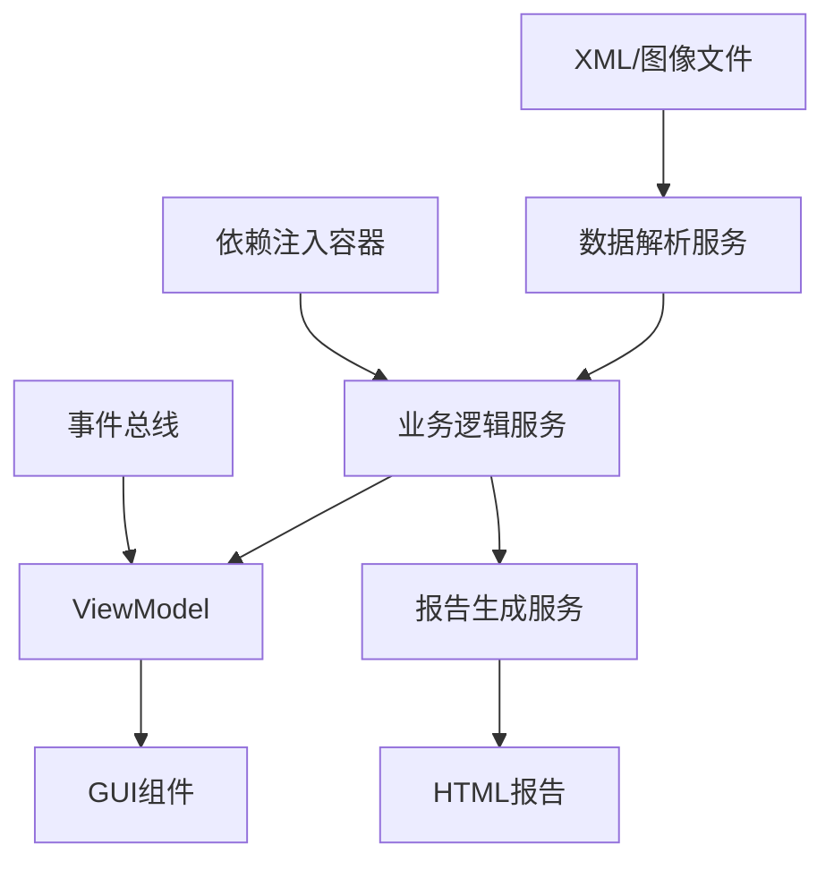

# FastMapV2 代码架构分析与优化建议

## 1. 项目概述

FastMapV2是一个基于PyQt5的桌面应用程序，用于Map配置分析、EXIF数据处理和仿写功能。项目采用现代化架构设计，包含5个主要功能模块。

### 技术栈
- **前端框架**: PyQt5 5.15.0+
- **数据处理**: pandas, numpy, matplotlib  
- **报告生成**: Jinja2, HTML/CSS/JS
- **架构模式**: MVVM + 依赖注入 + 事件总线

## 2. 整体架构设计评估

### 2.1 架构优势 ✅

**1. 清晰的分层架构**
```
GUI层 (View) → ViewModel → Service → Model
```
- 采用MVVM模式实现关注点分离
- 依赖注入容器管理服务生命周期
- 事件总线支持组件间松耦合通信

**2. 模块化服务设计**
```
core/services/
├── map_analysis/     # Map分析服务
├── exif_processing/  # EXIF处理服务
├── reporting/        # 报告生成服务
├── shared/           # 共享服务
└── feature_points/   # 特征点服务
```

**3. 接口抽象设计**
- 定义清晰的接口契约
- 支持依赖注入和单元测试
- 便于功能扩展和维护

### 2.2 架构问题与改进建议 ⚠️

**问题1: 耦合度仍有改进空间**
- **当前耦合度**: 6/10
- **目标耦合度**: 3/10

**改进措施**:
```python
# 当前: GUI直接调用服务
class MapAnalysisTab:
    def __init__(self):
        self.xml_parser = XMLParserService()  # ❌ 直接依赖

# 建议: 通过ViewModel解耦
class MapAnalysisTab:
    def __init__(self, viewmodel: MapAnalysisTabViewModel):
        self.viewmodel = viewmodel  # ✅ 依赖抽象
```

**问题2: 事件总线使用不充分**
- 部分组件仍通过直接调用通信
- 建议扩大事件驱动架构的使用范围

## 3. 代码重复与冗余分析

### 3.1 发现的重复代码

**1. 数值格式化重复 ❌**
- `XMLWriterService.format_number_for_xml()`  
- `map_data.py.format_field_value()`
- `map_table_widget.py.format_gui_number()`

**解决方案**: 已统一为 `utils/number_formatter.py`
```python
# 统一使用
from utils.number_formatter import format_decimal_precise
```

**2. 字段验证逻辑重复 ❌**
- 多个服务类包含相似的验证逻辑
- 建议抽取为共享验证服务

**3. 配置初始化重复 ❌**
- 多处包含相似的服务配置代码

### 3.2 冗余功能识别

**1. ViewModel功能重叠**
- `CopywritingTabViewModel` 和 `FeaturePointTabViewModel` 为占位实现
- 可合并为通用的 `PlaceholderTabViewModel`

**2. 报告生成器重复**
- HTML生成逻辑在多个类中重复
- 建议统一为报告工厂模式

## 4. 代码复杂度与文件长度分析

### 4.1 过长文件识别 📏

**需要拆分的文件**:

| 文件 | 行数 | 复杂度 | 建议 |
|------|------|--------|------|
| `gui/main_window.py` | 1132行 | 高 | 拆分为多个专门组件 |
| `core/services/map_analysis/xml_writer_service.py` | 1200行+ | 高 | 分离写入策略 |
| `gui/widgets/map_table_widget.py` | 1800行+ | 极高 | 重构为MVC模式 |
| `core/services/shared/field_registry_service.py` | 600行+ | 中 | 分离注册和查询逻辑 |

### 4.2 复杂函数识别 🔍

**需要重构的复杂函数**:

1. **`ImageClassifierService.classify()`** - 98行
   ```python
   # 建议拆分为:
   def classify(self, match_result, options):
       return ClassificationResult(
           categories=self._categorize_images(match_result, options),
           summary=self._calculate_summary(categories),
           total=self._count_total(categories)
       )
   ```

2. **`TemperatureSpanAnalyzer._clip_polygon()`** - 多重嵌套循环
   ```python
   # 建议提取子函数:
   def _clip_polygon(self, subject, clipper):
       return self._sutherland_hodgman_clip(subject, clipper)
   ```

### 4.3 拆分建议

**`gui/main_window.py` 拆分方案**:
```
gui/main_window.py (300行)
├── gui/components/tab_container.py
├── gui/components/menu_manager.py  
├── gui/components/status_manager.py
└── gui/components/drag_drop_handler.py
```

**`map_table_widget.py` 重构方案**:
```
gui/widgets/map_table/
├── map_table_widget.py (核心控件)
├── column_manager.py (列管理)
├── data_formatter.py (数据格式化)
├── edit_handler.py (编辑处理)
└── validation_handler.py (数据验证)
```

## 5. 功能模块总结

### 5.1 核心功能列表

**Map分析模块**
- XML文件解析与验证
- Map点数据可视化
- 温度跨度分析
- 多维度数据分析

**EXIF处理模块**  
- 批量EXIF数据提取
- CSV格式导出
- 图像分类与筛选
- 趋势分析生成

**报告生成模块**
- HTML交互式报告
- 图表数据可视化
- 多种报告模板
- 历史记录管理

**仿写功能模块** (Phase 3)
- Map配置自动仿写
- 参数智能优化  
- 结果质量验证

**特征点功能模块** (Phase 4)
- 特征点自动检测
- 特征点精确匹配
- 特征点质量分析

### 5.2 数据流架构



## 6. 全面功能测试用例设计

### 6.1 核心业务功能测试

#### 6.1.1 Map分析模块功能测试

**功能场景1: XML文件加载与解析**
```python
class TestMapAnalysisWorkflow:
    def test_xml_file_loading_success(self):
        """测试成功加载有效XML文件"""
        # 用例步骤:
        # 1. 选择有效的XML文件
        # 2. 验证文件格式正确性
        # 3. 解析Map点数据
        # 4. 显示基本统计信息
        # 预期结果: 成功加载并显示Map点列表
        
    def test_xml_file_validation_error(self):
        """测试加载无效XML文件的错误处理"""
        # 用例步骤:
        # 1. 选择格式错误的XML文件
        # 2. 系统进行文件验证
        # 3. 显示错误信息
        # 预期结果: 显示友好的错误提示信息
        
    def test_large_xml_file_performance(self):
        """测试大型XML文件处理性能"""
        # 用例步骤:
        # 1. 加载包含10000+Map点的XML文件
        # 2. 监控加载时间和内存使用
        # 预期结果: 加载时间<10秒，内存使用<500MB
```

**功能场景2: Map数据可视化**
```python
class TestMapVisualization:
    def test_scatter_plot_generation(self):
        """测试散点图生成功能"""
        # 用例步骤:
        # 1. 加载Map数据
        # 2. 选择X/Y轴字段
        # 3. 生成散点图
        # 4. 验证图表数据正确性
        
    def test_heat_map_generation(self):
        """测试热力图生成功能"""
        # 用例步骤:
        # 1. 选择权重字段
        # 2. 生成热力图
        # 3. 验证颜色映射正确性
        
    def test_temperature_zone_overlay(self):
        """测试色温区域叠加功能"""
        # 用例步骤:
        # 1. 启用色温区域显示
        # 2. 验证色温带绘制正确性
        # 3. 测试区域筛选功能
```

**功能场景3: Map数据编辑**
```python
class TestMapDataEditing:
    def test_table_cell_editing(self):
        """测试表格单元格编辑功能"""
        # 用例步骤:
        # 1. 双击表格单元格
        # 2. 修改数值
        # 3. 保存更改
        # 4. 验证数据同步到XML
        
    def test_batch_data_modification(self):
        """测试批量数据修改功能"""
        # 用例步骤:
        # 1. 选择多个Map点
        # 2. 批量修改权重值
        # 3. 保存修改
        # 4. 验证所有选中点都已更新
        
    def test_data_validation_during_edit(self):
        """测试编辑时的数据验证"""
        # 用例步骤:
        # 1. 输入超出范围的数值
        # 2. 验证系统拒绝无效输入
        # 3. 显示验证错误信息
```

#### 6.1.2 EXIF处理模块功能测试

**功能场景1: 批量EXIF数据提取**
```python
class TestExifProcessingWorkflow:
    def test_directory_scanning(self):
        """测试目录扫描功能"""
        # 用例步骤:
        # 1. 选择包含SAB图片的目录
        # 2. 递归扫描子目录
        # 3. 识别有效图片文件
        # 4. 显示扫描统计信息
        # 预期结果: 正确识别所有SAB文件
        
    def test_field_discovery(self):
        """测试EXIF字段发现功能"""
        # 用例步骤:
        # 1. 分析样本图片
        # 2. 自动发现可用EXIF字段
        # 3. 按优先级排序字段
        # 4. 显示字段选择界面
        
    def test_selective_field_extraction(self):
        """测试选择性字段提取"""
        # 用例步骤:
        # 1. 选择特定EXIF字段
        # 2. 执行批量提取
        # 3. 验证只提取选中字段
        # 4. 检查数据完整性
```

**功能场景2: CSV导出功能**
```python
class TestCsvExport:
    def test_standard_csv_export(self):
        """测试标准CSV导出"""
        # 用例步骤:
        # 1. 处理完EXIF数据
        # 2. 选择导出路径
        # 3. 执行CSV导出
        # 4. 验证CSV文件格式和内容
        
    def test_csv_with_raw_json(self):
        """测试包含原始JSON的CSV导出"""
        # 用例步骤:
        # 1. 启用"包含原始JSON"选项
        # 2. 执行导出
        # 3. 验证JSON数据完整性
        
    def test_large_dataset_export(self):
        """测试大数据集导出性能"""
        # 用例步骤:
        # 1. 处理1000+图片的EXIF数据
        # 2. 执行CSV导出
        # 预期结果: 导出时间<60秒
```

**功能场景3: 图像分类与筛选**
```python
class TestImageClassification:
    def test_field_based_classification(self):
        """测试基于字段的图像分类"""
        # 用例步骤:
        # 1. 选择主要分类字段
        # 2. 设置变化阈值
        # 3. 执行自动分类
        # 4. 验证分类结果准确性
        
    def test_export_by_category(self):
        """测试按类别导出图像"""
        # 用例步骤:
        # 1. 完成图像分类
        # 2. 选择要导出的类别
        # 3. 设置命名规则
        # 4. 执行批量导出
        # 5. 验证导出文件名和位置
```

#### 6.1.3 报告生成模块功能测试

**功能场景1: EXIF对比分析报告**
```python
class TestExifComparisonReport:
    def test_dual_dataset_comparison(self):
        """测试双数据集对比分析"""
        # 用例步骤:
        # 1. 加载测试数据集和参考数据集
        # 2. 选择对比字段
        # 3. 生成对比分析报告
        # 4. 验证统计指标正确性(MAE, RMSE, R²)
        
    def test_trend_analysis_charts(self):
        """测试趋势分析图表生成"""
        # 用例步骤:
        # 1. 配置趋势分析参数
        # 2. 生成交互式图表
        # 3. 验证图表数据准确性
        # 4. 测试图表交互功能
        
    def test_kpi_cards_generation(self):
        """测试KPI卡片生成"""
        # 用例步骤:
        # 1. 计算各字段的KPI指标
        # 2. 生成KPI卡片
        # 3. 验证指标计算正确性
```

**功能场景2: Map多维度分析报告**
```python
class TestMapMultiDimensionalReport:
    def test_scene_distribution_analysis(self):
        """测试场景分布分析"""
        # 用例步骤:
        # 1. 分析Map点场景分布
        # 2. 生成分布统计图表
        # 3. 验证场景分类准确性
        
    def test_temperature_span_analysis(self):
        """测试色温跨度分析"""
        # 用例步骤:
        # 1. 计算每个Map点的色温跨度
        # 2. 生成跨度统计报告
        # 3. 验证跨度计算算法
        
    def test_coordinate_range_analysis(self):
        """测试坐标范围分析"""
        # 用例步骤:
        # 1. 分析坐标分布范围
        # 2. 识别异常值
        # 3. 生成范围分析图表
```

### 6.2 用户工作流程测试

#### 6.2.1 完整Map分析工作流
```python
class TestCompleteMapAnalysisWorkflow:
    def test_end_to_end_map_analysis(self):
        """测试端到端Map分析流程"""
        # 完整用户场景:
        # 1. 启动应用程序
        # 2. 切换到Map分析Tab
        # 3. 拖拽XML文件到界面
        # 4. 验证文件加载成功
        # 5. 查看Map点数据表格
        # 6. 编辑部分Map点数据
        # 7. 生成可视化图表
        # 8. 保存修改到XML
        # 9. 生成Map分析报告
        # 预期结果: 整个流程顺畅完成，无错误
        
    def test_map_configuration_comparison(self):
        """测试Map配置对比流程"""
        # 完整用户场景:
        # 1. 加载对比机XML配置
        # 2. 加载调试机XML配置
        # 3. 执行差异分析
        # 4. 高亮显示差异点
        # 5. 生成差异分析报告
        # 6. 导出差异数据
```

#### 6.2.2 完整EXIF处理工作流
```python
class TestCompleteExifProcessingWorkflow:
    def test_end_to_end_exif_processing(self):
        """测试端到端EXIF处理流程"""
        # 完整用户场景:
        # 1. 切换到EXIF处理Tab
        # 2. 选择图片目录
        # 3. 系统自动发现EXIF字段
        # 4. 用户选择需要的字段
        # 5. 执行批量处理
        # 6. 监控处理进度
        # 7. 导出CSV文件
        # 8. 执行图像分类
        # 9. 按类别导出图像
        # 10. 生成EXIF对比分析报告
        # 预期结果: 处理完成，获得CSV和分类图像
        
    def test_exif_trend_analysis_workflow(self):
        """测试EXIF趋势分析工作流"""
        # 完整用户场景:
        # 1. 加载测试数据集
        # 2. 加载参考数据集
        # 3. 配置对比参数
        # 4. 执行趋势分析
        # 5. 查看KPI指标
        # 6. 生成交互式报告
        # 7. 分享报告链接
```

### 6.3 异常场景测试

#### 6.3.1 文件处理异常测试
```python
class TestFileHandlingExceptions:
    def test_corrupted_xml_file(self):
        """测试损坏XML文件处理"""
        # 异常场景: XML文件内容损坏
        # 预期行为: 显示错误信息，不崩溃
        
    def test_unsupported_image_format(self):
        """测试不支持的图像格式"""
        # 异常场景: 尝试处理非SAB格式图片
        # 预期行为: 跳过不支持文件，继续处理其他文件
        
    def test_insufficient_disk_space(self):
        """测试磁盘空间不足"""
        # 异常场景: 导出时磁盘空间不足
        # 预期行为: 显示空间不足警告，停止导出
        
    def test_file_permission_denied(self):
        """测试文件权限被拒绝"""
        # 异常场景: 尝试写入只读文件夹
        # 预期行为: 显示权限错误，提供解决建议
```

#### 6.3.2 网络和系统异常测试
```python
class TestSystemExceptions:
    def test_memory_exhaustion(self):
        """测试内存耗尽处理"""
        # 异常场景: 处理超大数据集导致内存不足
        # 预期行为: 显示内存警告，建议分批处理
        
    def test_application_crash_recovery(self):
        """测试应用崩溃恢复"""
        # 异常场景: 应用意外崩溃
        # 预期行为: 重启时恢复未保存的工作
        
    def test_dependency_missing(self):
        """测试依赖包缺失处理"""
        # 异常场景: 关键依赖包未安装
        # 预期行为: 启动时检查依赖，提供安装指导
```

### 6.4 性能基准测试

#### 6.4.1 数据处理性能测试
```python
class TestPerformanceBenchmarks:
    def test_xml_parsing_performance(self):
        """XML解析性能基准测试"""
        # 性能指标:
        # - 1MB XML文件: <2秒
        # - 10MB XML文件: <10秒
        # - 内存使用: <文件大小的5倍
        
    def test_exif_processing_performance(self):
        """EXIF处理性能基准测试"""
        # 性能指标:
        # - 100张图片: <30秒
        # - 1000张图片: <5分钟
        # - 并发处理能力: 支持4个线程
        
    def test_visualization_rendering_performance(self):
        """可视化渲染性能测试"""
        # 性能指标:
        # - 1000个Map点散点图: <3秒
        # - 10000个Map点热力图: <10秒
        # - 图表交互响应: <100ms
        
    def test_report_generation_performance(self):
        """报告生成性能测试"""
        # 性能指标:
        # - HTML报告生成: <5秒
        # - 包含大量图表的报告: <15秒
        # - 报告文件大小: <10MB
```

### 6.5 用户体验测试

#### 6.5.1 界面交互测试
```python
class TestUserExperience:
    def test_drag_drop_functionality(self):
        """测试拖拽功能"""
        # UX场景: 用户拖拽文件到应用
        # 验证点: 拖拽区域高亮，文件类型验证，加载反馈
        
    def test_progress_feedback(self):
        """测试进度反馈"""
        # UX场景: 长时间操作的进度显示
        # 验证点: 进度条准确性，可取消操作，预估时间
        
    def test_error_message_clarity(self):
        """测试错误信息清晰度"""
        # UX场景: 各种错误情况的信息显示
        # 验证点: 错误描述清晰，提供解决建议，避免技术术语
        
    def test_keyboard_shortcuts(self):
        """测试键盘快捷键"""
        # UX场景: 常用操作的快捷键支持
        # 验证点: Ctrl+O打开文件，Ctrl+S保存，F5刷新等
```

#### 6.5.2 可访问性测试
```python
class TestAccessibility:
    def test_keyboard_navigation(self):
        """测试键盘导航"""
        # 验证Tab键可以遍历所有可交互元素
        
    def test_high_contrast_support(self):
        """测试高对比度支持"""
        # 验证在高对比度模式下界面的可读性
        
    def test_font_scaling_support(self):
        """测试字体缩放支持"""
        # 验证不同字体大小下界面的适应性
```

### 6.6 单元测试覆盖

**服务层测试** (目标覆盖率: 90%+)

```python
# core/services/ 测试用例
class TestXMLParserService:
    def test_parse_valid_xml(self):
        """测试有效XML文件解析"""
        
    def test_parse_invalid_xml(self):
        """测试无效XML文件处理"""
        
    def test_field_extraction(self):
        """测试字段提取功能"""

class TestExifParserService:
    def test_batch_processing(self):
        """测试批量EXIF处理"""
        
    def test_field_selection(self):
        """测试字段选择功能"""
        
    def test_csv_export(self):
        """测试CSV导出功能"""

class TestReportGenerator:
    def test_html_generation(self):
        """测试HTML报告生成"""
        
    def test_chart_data_preparation(self):
        """测试图表数据准备"""
        
    def test_template_rendering(self):
        """测试模板渲染功能"""
```

**ViewModel测试**
```python
class TestMapAnalysisTabViewModel:
    def test_xml_file_loading(self):
        """测试XML文件加载功能"""
        
    def test_analysis_execution(self):
        """测试分析执行功能"""
        
    def test_data_validation(self):
        """测试数据验证功能"""
        
    def test_error_handling(self):
        """测试错误处理机制"""
```

### 6.2 集成测试场景

**工作流集成测试**
```python
class TestMapAnalysisWorkflow:
    def test_complete_analysis_workflow(self):
        """测试完整的Map分析工作流"""
        # 1. 加载XML文件
        # 2. 数据验证
        # 3. 执行分析
        # 4. 生成报告
        # 5. 验证结果
        
class TestExifProcessingWorkflow:
    def test_batch_exif_processing(self):
        """测试批量EXIF处理工作流"""
        # 1. 选择图像目录
        # 2. 字段发现
        # 3. 批量处理
        # 4. CSV导出
        # 5. 结果验证
```

### 6.3 性能测试用例

```python
class TestPerformance:
    def test_large_xml_parsing(self):
        """测试大型XML文件解析性能"""
        # 目标: 10MB XML文件 < 5秒
        
    def test_batch_image_processing(self):
        """测试批量图像处理性能"""
        # 目标: 1000张图片 < 30秒
        
    def test_memory_usage(self):
        """测试内存使用情况"""
        # 目标: 峰值内存 < 1GB
```

### 6.4 GUI自动化测试

```python
class TestGUIAutomation:
    def test_tab_navigation(self):
        """测试标签页导航功能"""
        
    def test_file_drag_drop(self):
        """测试文件拖拽功能"""
        
    def test_table_editing(self):
        """测试表格编辑功能"""
        
    def test_report_generation_ui(self):
        """测试报告生成界面"""
```

### 6.5 错误处理测试

```python
class TestErrorHandling:
    def test_invalid_file_handling(self):
        """测试无效文件处理"""
        
    def test_network_error_handling(self):
        """测试网络错误处理"""
        
    def test_memory_exhaustion_handling(self):
        """测试内存耗尽处理"""
        
    def test_dependency_injection_errors(self):
        """测试依赖注入错误"""
```

## 7. 架构改进路线图

### Phase 1: 代码重构 (2周)
1. **拆分长文件**
   - `main_window.py` → 4个组件
   - `map_table_widget.py` → MVC模式
   - `xml_writer_service.py` → 策略模式

2. **消除代码重复**
   - 统一数值格式化
   - 抽取共享验证逻辑
   - 合并占位ViewModel

### Phase 2: 架构优化 (2周)  
1. **增强依赖注入**
   - 扩大DI容器使用范围
   - 添加接口抽象层
   - 实现配置驱动注册

2. **扩展事件总线**
   - 替换直接调用为事件通信
   - 添加事件追踪和调试
   - 实现事件持久化

### Phase 3: 测试完善 (1周)
1. **提升测试覆盖率**
   - 单元测试覆盖率达到90%+
   - 添加集成测试场景  
   - 实现GUI自动化测试

2. **性能优化**
   - 大文件处理优化
   - 内存使用优化
   - UI响应性提升

## 8. 质量度量指标

### 当前状态
- **耦合度**: 6/10
- **测试覆盖率**: 65%
- **代码重复率**: 15%
- **平均函数长度**: 45行
- **平均文件长度**: 380行

### 目标状态  
- **耦合度**: 3/10
- **测试覆盖率**: 90%+
- **代码重复率**: <5%
- **平均函数长度**: <30行
- **平均文件长度**: <300行

## 9. 技术债务清单

### 高优先级
1. 拆分超长文件 (`map_table_widget.py`, `main_window.py`)
2. 重构复杂函数 (`ImageClassifierService.classify()`)
3. 消除数值格式化重复代码
4. 增加缺失的单元测试

### 中优先级  
1. 优化依赖注入使用
2. 扩展事件总线架构
3. 重构报告生成器
4. 添加性能监控

### 低优先级
1. 优化GUI组件结构
2. 增强错误处理机制
3. 完善文档和注释
4. 添加代码质量工具

FastMapV2项目整体架构设计合理，采用了现代化的设计模式和最佳实践。主要改进空间在于降低耦合度、消除代码重复、拆分长文件和提升测试覆盖率。通过系统性的重构优化，可以显著提升代码质量和可维护性。