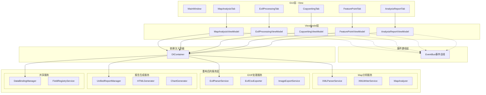

# FastMapV2 架构解耦分析与重构设计文档

## 1. 当前架构分析结果

### 1.1 项目概览
FastMapV2是一个基于PyQt5的桌面应用程序，采用5个Tab的标签页设计：
- **Map分析Tab**: XML文件解析、Map点列表、形状可视化
- **EXIF处理Tab**: 图片目录解析、字段选择、CSV导出  
- **仿写功能Tab**: 占位符，待实现
- **特征点功能Tab**: 占位符，待实现
- **分析报告Tab**: 统一报告生成与管理

### 1.2 耦合性问题识别

#### 🔴 高耦合问题

**1. 直接实例化耦合**
```python
# 问题：MainWindow直接创建所有Tab和服务
class MainWindow(QMainWindow):
    def create_map_analysis_tab(self):
        self.map_table = MapTableWidget()  # 直接创建
        self.map_shape_viewer = MapShapeViewer()  # 直接创建
        
    def create_exif_processing_tab(self):
        return ExifProcessingTab(self)  # 传递self作为parent
```

**2. 状态共享耦合**
```python
# 问题：报告Tab通过parent访问其他Tab的数据
def open_map_analysis_dialog(self):
    main_window = self.get_main_window()  # 向上查找父窗口
    if not hasattr(main_window, 'map_configuration'):  # 直接访问属性
        # 显示错误提示
```

**3. 信号槽直连耦合**
```python
# 问题：组件间直接连接，缺少解耦中介
self.map_table.map_point_selected.connect(self.on_map_point_selected)
self.map_table.base_boundary_selected.connect(self.on_base_boundary_selected)
```

#### 🟡 中等耦合问题

**1. 服务混合耦合**
```python
# ExifProcessingTab同时依赖多个服务，且直接创建
class ExifProcessingTab(QWidget):
    def __init__(self, parent=None, parser: IExifParserService = None, exporter: IExifCsvExporter = None):
        self.parser = parser or ExifParserService()  # 直接创建默认实现
        self.exporter = exporter or ExifCsvExporter()  # 直接创建默认实现
```

**2. 业务逻辑GUI混合**
- MainWindow既处理UI创建，又处理菜单事件、拖拽处理
- Tab组件包含大量业务逻辑代码

### 1.3 现有服务层混乱程度分析

#### 当前core/services目录结构（22个文件）：
```
core/services/ (按功能混合排列)
├── chart_generator.py                      # 图表生成 - 报告功能
├── combined_report_data_provider.py         # 综合报告数据 - 报告功能  
├── data_binding_manager_impl.py             # 数据绑定 - 通用基础
├── exif_comparison_report_generator.py      # EXIF对比报告 - EXIF功能
├── exif_csv_exporter.py                    # EXIF CSV导出 - EXIF功能
├── exif_parser_service.py                  # EXIF解析 - EXIF功能
├── exif_raw_exporter.py                    # EXIF原始导出 - EXIF功能
├── exif_report_helpers.py                  # EXIF报告辅助 - EXIF功能
├── field_editor_factory.py                 # 字段编辑器 - 通用基础
├── field_registry_service.py               # 字段注册服务 - 通用基础
├── html_generator.py                       # HTML生成 - 报告功能
├── image_classifier_service.py             # 图像分类 - 特征点功能
├── image_export_service.py                 # 图像导出 - EXIF功能
├── image_export_workflow_service.py        # 图像导出流程 - EXIF功能
├── map_analyzer.py                         # Map分析 - Map功能
├── map_multi_dimensional_report_generator.py # Map多维度报告 - Map功能
├── multi_dimensional_analyzer.py           # 多维度分析 - Map功能
├── temperature_span_analyzer.py            # 温度范围分析 - Map功能
├── unified_report_manager.py               # 统一报告管理 - 报告功能
├── xml_parser_service.py                   # XML解析 - Map功能
└── xml_writer_service.py                   # XML写入 - Map功能
```

**服务层问题**：
- 按功能混合排列，缺乏清晰的模块边界
- 某些服务职责过重（如xml_parser_service.py 42KB）
- 服务间依赖关系复杂，难以单独测试

## 2. 目标架构设计：MVVM + 依赖注入

### 2.1 架构设计原则
- **MVVM模式**: View(GUI) -> ViewModel(业务逻辑) -> Model(数据)
- **依赖注入**: 通过DI容器管理所有服务依赖
- **事件总线**: ViewModel间通过事件通信，避免直接依赖
- **服务分层**: 按GUI功能模块重组服务层

### 2.2 目标架构图



### 2.3 重构后的服务层组织结构

```
core/services/
├── map_analysis/                    # Map分析相关服务
│   ├── __init__.py
│   ├── xml_parser_service.py        # XML解析服务
│   ├── xml_writer_service.py        # XML写入服务
│   ├── xml_validation_service.py    # XML验证服务 (新拆分)
│   ├── map_analyzer.py              # Map数据分析
│   ├── temperature_span_analyzer.py # 温度范围分析
│   ├── multi_dimensional_analyzer.py # 多维度分析
│   └── map_conversion_service.py    # Map数据转换 (新拆分)
│
├── exif_processing/                 # EXIF处理相关服务
│   ├── __init__.py
│   ├── exif_parser_service.py       # EXIF解析服务
│   ├── exif_discovery_service.py    # EXIF字段发现 (新拆分)
│   ├── exif_csv_exporter.py         # CSV导出服务
│   ├── exif_raw_exporter.py         # 原始数据导出
│   ├── image_export_service.py      # 图像导出服务
│   ├── image_export_workflow_service.py # 图像导出流程
│   ├── file_handler_service.py      # 文件处理服务 (新拆分)
│   └── progress_manager_service.py  # 进度管理服务 (新拆分)
│
├── copywriting/                     # 仿写功能相关服务 (占位符)
│   ├── __init__.py
│   ├── config_comparison_service.py # 配置对比服务 (预留)
│   ├── offset_calculation_service.py # 偏移计算服务 (预留)
│   └── copywriting_engine_service.py # 仿写引擎服务 (预留)
│
├── feature_points/                  # 特征点功能相关服务 (占位符)
│   ├── __init__.py
│   ├── image_classifier_service.py  # 图像分类服务
│   ├── feature_extraction_service.py # 特征提取服务 (预留)
│   └── pattern_recognition_service.py # 模式识别服务 (预留)
│
├── reporting/                       # 报告生成相关服务
│   ├── __init__.py
│   ├── unified_report_manager.py    # 统一报告管理
│   ├── html_generator.py            # HTML生成服务
│   ├── chart_generator.py           # 图表生成服务
│   ├── exif_comparison_report_generator.py # EXIF对比报告
│   ├── map_multi_dimensional_report_generator.py # Map多维度报告
│   ├── combined_report_data_provider.py # 综合报告数据提供
│   ├── exif_report_helpers.py       # EXIF报告辅助工具
│   └── template_manager_service.py  # 模板管理服务 (新拆分)
│
└── shared/                          # 共享通用服务
    ├── __init__.py
    ├── data_binding_manager_impl.py # 数据绑定管理
    ├── field_registry_service.py   # 字段注册服务
    ├── field_editor_factory.py     # 字段编辑器工厂
    ├── cache_manager_service.py    # 缓存管理服务 (新增)
    ├── error_handler_service.py    # 错误处理服务 (新增)
    ├── validation_service.py       # 数据验证服务 (新增)
    └── logging_service.py          # 日志服务 (新增)
```

## 3. 重构实施计划

### 3.1 重构任务清单

#### 阶段1：服务层重组 ✅ 已完成 (2025-08-22)
- [x] **创建新的目录结构** ✅
  - [x] 创建 map_analysis/ 目录
  - [x] 创建 exif_processing/ 目录  
  - [x] 创建 copywriting/ 目录 (占位符)
  - [x] 创建 feature_points/ 目录 (占位符)
  - [x] 创建 reporting/ 目录
  - [x] 创建 shared/ 目录

- [x] **移动现有服务文件** ✅
  - [x] xml_parser_service.py → map_analysis/
  - [x] xml_writer_service.py → map_analysis/
  - [x] map_analyzer.py → map_analysis/
  - [x] temperature_span_analyzer.py → map_analysis/
  - [x] multi_dimensional_analyzer.py → map_analysis/
  - [x] exif_*.py → exif_processing/
  - [x] image_export_*.py → exif_processing/
  - [x] image_classifier_service.py → feature_points/
  - [x] html_generator.py → reporting/
  - [x] chart_generator.py → reporting/
  - [x] *_report_*.py → reporting/
  - [x] data_binding_*.py → shared/

- [x] **更新引用关系** ✅
  - [x] 批量更新61个文件的import路径
  - [x] 修复类名不匹配问题
  - [x] 测试通过：所有服务可正常导入

**重组结果**：
- 原22个混乱排列的服务文件 → 按6个功能模块清晰组织
- 服务职责边界更加清晰，便于维护和扩展
- 为后续ViewModel层建设奠定基础

#### 阶段2：基础设施搭建 ✅ 已完成 (2025-08-22)
- [x] **创建依赖注入容器** ✅
  ```python
  class DIContainer:
      def register_singleton(self, service_type, implementation)
      def register_transient(self, service_type, implementation)  
      def resolve(self, service_type)
  ```
  - 支持单例和瞬态服务生命周期管理
  - 自动依赖解析和循环依赖检测
  - 线程安全，支持并发访问
  - 已注册16个核心服务

- [x] **创建事件总线系统** ✅
  ```python
  class EventBus:
      def subscribe(self, event_type, handler, source_name)
      def unsubscribe(self, event_type, handler)
      def emit(self, event_type, data, source)
  ```
  - 定义25个事件类型，涵盖所有业务场景
  - 弱引用管理，自动清理失效处理器
  - 事件历史记录和统计信息
  - 线程安全，支持并发订阅/发布

- [x] **创建ViewModel基类** ✅
  ```python
  class BaseViewModel(QObject):
      property_changed = pyqtSignal(str, object)
      error_occurred = pyqtSignal(str)
      status_message = pyqtSignal(str)
  ```
  - 属性变更通知机制
  - 事件总线集成和依赖注入支持
  - 忙碌状态管理和错误处理
  - 命令模式支持

**实现的ViewModel**：
- [x] **MapAnalysisViewModel** - 处理XML解析、Map分析、报告生成
- [x] **ExifProcessingViewModel** - 处理EXIF解析、字段发现、CSV导出
- [x] **AnalysisReportViewModel** - 处理统一报告生成、历史管理

**测试结果**：
- ✅ 依赖注入容器正常工作，成功注册和解析服务
- ✅ 事件总线正常工作，事件发布/订阅成功
- ✅ ViewModel基类功能正常，属性管理和事件集成成功
- ⚠️ 部分服务依赖问题已解决（需要特定参数的服务改为动态创建）

#### 阶段3：ViewModel层实现 (第2-3周)
- [ ] **MapAnalysisViewModel**
  - [ ] XML文件加载逻辑
  - [ ] Map数据分析逻辑
  - [ ] 事件发布：MAP_LOADED, MAP_ANALYZED

- [ ] **ExifProcessingViewModel**  
  - [ ] 目录扫描逻辑
  - [ ] 字段发现逻辑
  - [ ] CSV导出逻辑

- [ ] **AnalysisReportViewModel**
  - [ ] 报告生成逻辑
  - [ ] 历史记录管理
  - [ ] 事件订阅：MAP_LOADED, EXIF_PROCESSED

#### 阶段4：GUI层重构 (第3-4周)
- [ ] **重构Tab组件**
  - [ ] 移除业务逻辑，只保留UI代码
  - [ ] 通过ViewModel访问数据和服务
  - [ ] 实现数据绑定

- [ ] **重构MainWindow**
  - [ ] 移除直接服务创建
  - [ ] 通过DI容器注入ViewModel
  - [ ] 简化为纯UI管理

### 3.2 重构收益分析

#### 短期收益
- **职责分离**: GUI专注UI，ViewModel处理业务逻辑
- **依赖解耦**: 通过DI容器管理所有依赖关系  
- **服务细化**: 每个服务职责单一，易于维护
- **模块清晰**: 按功能组织的服务更易理解

#### 长期收益
- **可测试性**: ViewModel可独立进行单元测试
- **可扩展性**: 新功能通过注册服务和处理器添加
- **团队协作**: 前后端可并行开发
- **代码复用**: 服务层可在其他项目中复用

### 3.3 风险控制策略

#### 渐进式重构
- 每次只重构一个模块，确保其他功能正常
- 保留原有接口，逐步迁移到新架构
- 完善单元测试，确保重构不破坏功能

#### 回滚机制
- 使用版本控制分支进行重构
- 每个阶段完成后合并到主分支
- 如有问题可随时回滚到稳定版本

## 4. 实施注意事项

### 4.1 优先级安排
1. **高优先级**: 服务层重组和基础设施搭建
2. **中优先级**: ViewModel层实现
3. **低优先级**: GUI层重构和优化

### 4.2 测试策略
- 每个重构阶段都要编写对应的单元测试
- 确保重构前后功能一致性
- 性能测试确保重构不影响性能

### 4.3 文档更新
- 及时更新架构文档
- 编写新组件的使用指南
- 更新开发规范和最佳实践

## 5. 总结

当前FastMapV2架构存在明显的耦合性问题，主要体现在：
1. GUI层与业务逻辑混合
2. Tab间通过parent共享状态
3. 服务层组织混乱，职责不清

通过MVVM+依赖注入的重构方案，可以：
1. 实现GUI与业务逻辑的完全分离
2. 通过事件总线解耦Tab间通信
3. 按功能模块重组服务层，提高代码清晰度

预计重构周期4周，采用渐进式重构策略，确保系统稳定性的同时提升架构质量。